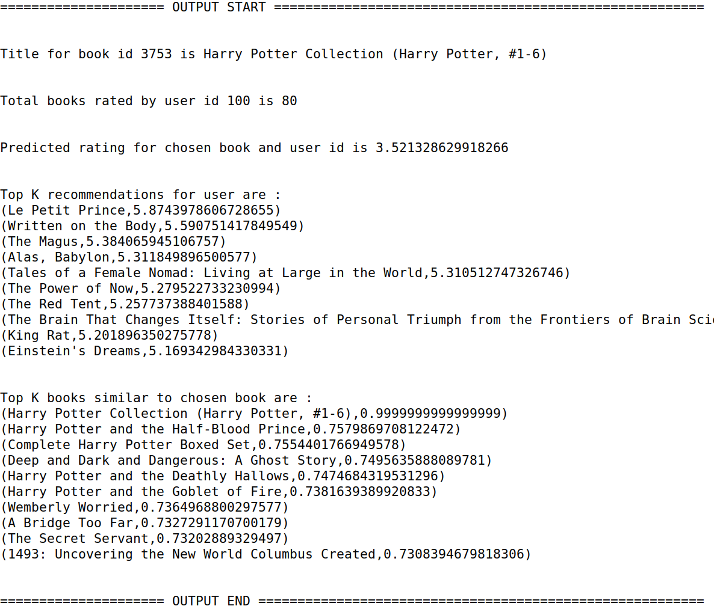
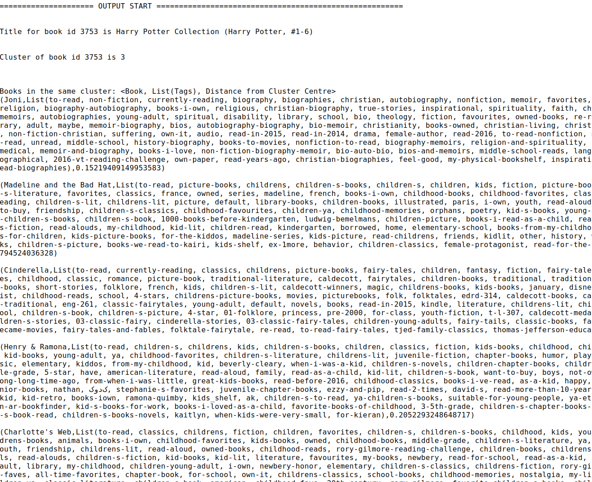
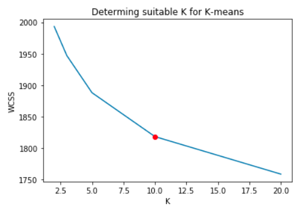

### Introduction
The motivation of this project is to build the recommenders system using Apache Spark about user's book preference. Recommender systems uses data models in order to predict certain behaviour. The trained model will compute recommendations for a given user as well as compute similar or related items for a given item.

### Dataset
The dataset used for this project is the [goodbooks-10k](https://www.kaggle.com/zygmunt/goodbooks-10k) and was obtained on Kaggle.
This dataset contains six million ratings for ten thousand most popular books. 
The dataset contains several csv files. The file book.csv contains ten thousand book entries with a number of labels: various IDs, ISBN, author(s), original title, original publication year, language, books count, various ratings etc. In addition to the books.csv, there are four more csv files (book_tags, ratings, tags, to_read) , representing additional information, that are bounded by one of a primary key (book_id, user_id, tag_id).

### Recommendation
The following three approaches were applied in order to do the recommendations:
* __ALS (Alternating Least Squares)__: Its an approach based on collaborative filtering which is a technique based on mapping a user item association using a user-item matrix. ALS tries to find latent factors for items and users and those factors are used to predict the rating of a given item by a given user. So the books which are predicted to be of higher rating for a given user, can be recommended to that person.
* __KMeans__ : K-means clustering is a type of unsupervised learning and its goal is to find groups in the data, with the number of groups represented by the variable K. The algorithm works iteratively to assign each data point to one of K groups based on the features that are provided. So in this case, it means grouping books into different clusters based on some feature.
* __Deep Learning model__ : Deep learning model was used as one of the alternative models to predict the rating by giving user-id and book-id as features.

### Implementation Details ###
For recommendation part, Spark, Scala and Python were used.
* __For ALS__: Spark MLlib library and Scala was used.
    * User id and Book id was given as inputs to ALS model with user and book factors as output. 
    * For the given user, top K recommendations were the books for which the predicted rating was highest.
    * For the given book, top K similar books were found out by cosine similarity between factors of all the books and the  given book and finding the top K with highest similarity metric.

    __How to run the code__:

        1. Spark should be running in local mode. 
        2. *sbt run* and choose option 2 that corresponds to Recommender.scala .
        3. The output will be specified in the console within a block.
        4. The fields _sampleBookId_ and _sampleUserId_ can be changed to get predictions for different books and users.
    
* __For KMeans__: Spark MLlib library and Scala was used.
    User and Book Factors were given as features to K means clustering algorithm. The value of K was obtained using cross-validation. For the recommendation part, the cluster for a given book was determined and the topK books in the same cluster with the least distance from cluster centre were recommended.

    __How to run the code__:
    
        1. Spark should be running in local mode. 
        2. *sbt run* and choose option 1 that corresponds to BookClustering.scala .
        3. The output will be specified in the console within a block.
        4. The fields *sampleBookId* can be changed to get predictions for different books.
    
    _The output shown in console for ALS and KMeans is just for demonstration purposes. Ideally a logger should be used after configuring log4j template for Spark._
    
    
    __For Deep Learning model__: PySpark, Numpy and Keras was used. 
    The ratings RDD was obtained using pyspark and converted into arrays using numpy.
    For training a Deep Learning Model, Keras was used to build a model with 3 hidden layers with ReLU activation and final layer with Softmax activation function.
    So given a user id and book id, the model would predict a rating between 0-5.

    __How to run the code__:
    
        * Spark should be running in local mode. 
        * Create a conda environment with python 3.5
        * Install findspark, numpy, keras and tensorflow 
          * conda install -c conda-forge findspark 
          * conda install -c anaconda numpy 
          * conda install -c conda-forge tensorflow 
          * conda install -c conda-forge keras 
        * Run jupyter notebook in that conda environment by chosing that kernel.
        * For the model part, it can be directly loaded from saved model as running model from beginning takes time
        * The fields *sampleBookId* and *sampleUserId* can be changed to get predictions for different books and users.
    
### Results
Following were the results for different approaches:
* __For ALS__: Mean Squared Error = 0.1076

    
* __For KMeans__: 

* __How to determine k__: 

* __For Deep Learning Model__: 
    The accuracy on the test set(20% of the data) was 35.8% which was not that satisfactory. This indicated that more features need to be used.
    
    
### Improvements to be done
There are several things that can be followed as future work to improve upon further:
* Expose as API maybe using Flask
* Convert codebase to use DataFrame instead of RDD and Spark ML instead of Spark MLlib.
* Hyperparameter tuning of the ALS model.
* Incorporating more features into the deep learning model e.g. tags or authors.
* (Minor Change)Right now the data files without headers are fed to Spark, code can be changed to accept csv files with headers.
* (Minor change) Allow user to input sampleUserId and sampleBookId instead of changing in files.

